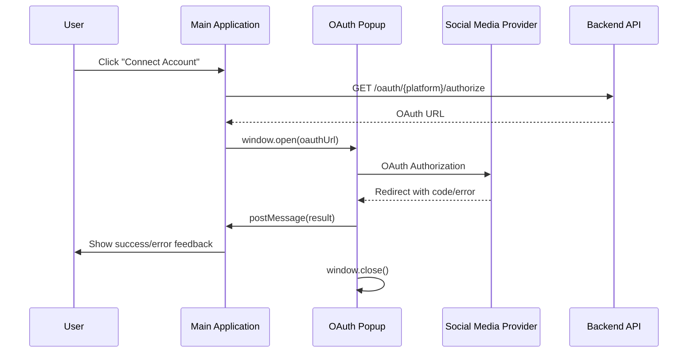

# Enhanced OAuth Integration with Popup Windows

This document outlines the improved OAuth implementation for social media account connections using popup windows instead of full page redirects.

## Overview

The enhanced OAuth flow provides a better user experience by:
- 🎯 **Keeping main application context** - Users stay on the current page
- 🔒 **Enhanced security** - Origin verification and secure message passing
- ⚡ **Better UX** - No page reloads or navigation disruptions
- 🛠️ **Robust error handling** - Comprehensive error states and user feedback
- 🔄 **Automatic cleanup** - Proper resource management and event listener cleanup

## Architecture

### Components

1. **OAuth Utility Functions** (`/src/utils/oauthConnect.ts`)
   - `connectSocial()` - Opens OAuth popup and handles the flow
   - `handleOAuthCallback()` - Processes OAuth callbacks in popup window

2. **OAuth Callback Page** (`/src/app/auth/oauth/callback/page.tsx`)
   - Receives OAuth redirects from social media platforms
   - Communicates results back to parent window via postMessage API

3. **Custom Hook** (`/src/hooks/useOAuthMessageListener.ts`)
   - Reusable hook for handling OAuth popup messages
   - Provides clean abstraction for OAuth message handling

4. **Integration Pages**
   - `/src/app/dashboard/social-accounts/create/page.tsx`
   - `/src/app/dashboard/social-accounts/page.tsx`

## Implementation Details

### OAuth Flow Sequence



### Message Communication

OAuth results are communicated using the postMessage API with the following structure:

```typescript
interface OAuthMessage {
  type: 'OAUTH_SUCCESS' | 'OAUTH_ERROR';
  data?: {
    code?: string;
    state?: string;
    platform?: string;
    timestamp?: string;
  };
  error?: string;
  provider?: string;
  timestamp?: string;
}
```

### Security Features

- **Origin Verification**: All messages verify `event.origin` matches `window.location.origin`
- **Message Type Validation**: Only processes known OAuth message types
- **Timeout Protection**: 5-minute timeout prevents hanging popups
- **Popup Blocking Detection**: Graceful handling when popups are blocked

### Error Handling

The implementation handles various error scenarios:

- **Popup Blocked**: User-friendly message with instructions
- **User Cancellation**: Graceful handling when user closes popup manually
- **Network Timeouts**: 5-minute timeout with appropriate error message
- **OAuth Errors**: Server-side OAuth errors are properly communicated
- **Invalid Responses**: Validation of message structure and content

## Usage Examples

### Using the Custom Hook

```typescript
import { useOAuthMessageListener } from '@/hooks/useOAuthMessageListener';

// In your component
useOAuthMessageListener({
  onSuccess: (data, provider) => {
    console.log('OAuth success:', provider);
    // Handle successful OAuth
    refetchAccounts();
    showSuccessToast();
  },
  onError: (error) => {
    console.error('OAuth error:', error);
    // Handle OAuth errors
    showErrorToast(error);
  },
  enabled: isOAuthInProgress // Optional: only listen when needed
});
```

### Initiating OAuth Flow

```typescript
import { connectSocial } from '@/utils/oauthConnect';

const handleConnect = async (platform: string) => {
  try {
    await connectSocial(platform);
    // The custom hook will handle the response
  } catch (error) {
    // Handle immediate errors (popup blocked, etc.)
    handleError(error);
  }
};
```

## Configuration

### Backend Requirements

Ensure your backend OAuth endpoints return the callback URL pointing to:
```
{domain}/auth/oauth/callback
```

### Environment Variables

The implementation uses the current window origin for security. No additional environment variables are required.

## Error Messages

The implementation provides specific error messages for common scenarios:

- **Popup Blocked**: "Please allow popups for this site and try again."
- **User Cancelled**: "Authorization was cancelled. Please try again."
- **Timeout**: "Authorization timed out. Please try again."
- **Generic OAuth Error**: Platform-specific error messages from the OAuth provider

## Benefits Over Previous Implementation

1. **Better UX**: No page redirects or loss of application state
2. **Improved Security**: Enhanced origin verification and message validation
3. **Robust Error Handling**: Comprehensive error scenarios covered
4. **Cleaner Code**: Reusable custom hook reduces code duplication
5. **Better TypeScript Support**: Strongly typed interfaces and message structures
6. **Resource Management**: Automatic cleanup of event listeners and timeouts

## Browser Compatibility

The implementation uses modern browser APIs:
- `window.open()` - Supported in all modern browsers
- `postMessage()` - Supported in all modern browsers
- `addEventListener()` - Supported in all modern browsers

## Testing Considerations

When testing OAuth flows:

1. **Popup Blocker Testing**: Test with popup blockers enabled
2. **Network Timeout Testing**: Test with slow/interrupted connections
3. **User Cancellation Testing**: Test manual popup closure
4. **Multiple Platform Testing**: Verify each social media platform works correctly
5. **Message Security Testing**: Verify origin checking works properly

## Migration Notes

If migrating from the previous full-page redirect implementation:

1. Update backend OAuth redirect URLs to point to `/auth/oauth/callback`
2. Replace useEffect OAuth message listeners with the new custom hook
3. Update error handling to use the new error message structure
4. Test all OAuth flows thoroughly with the popup implementation

## Future Enhancements

Potential improvements for future iterations:

- **Multiple Account Support**: Handle multiple accounts per platform
- **OAuth Token Refresh**: Automatic token refresh in background
- **Platform-Specific Optimizations**: Customize popup sizes per platform
- **Analytics Integration**: Track OAuth success/failure rates
- **Progressive Enhancement**: Fallback to full-page redirects if popups fail
